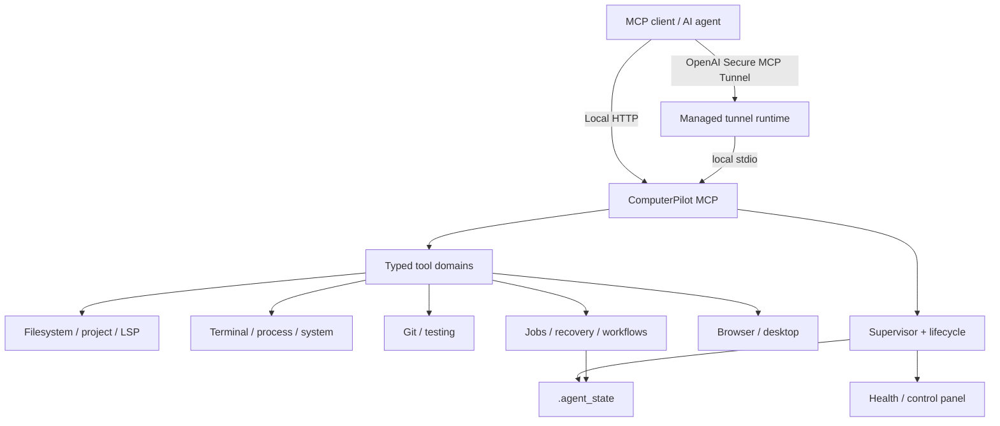

# ComputerPilot MCP

**Supervised computer use and developer automation over the Model Context Protocol.**

[](https://github.com/dibbed/computerpilot-mcp/releases/latest)
[](https://github.com/dibbed/computerpilot-mcp/actions/workflows/ci.yml)
[](https://github.com/dibbed/computerpilot-mcp/actions/workflows/platform-validation.yml)
[](https://www.python.org/)
[](LICENSE)

ComputerPilot MCP gives MCP-capable AI agents a local runtime for **files, terminal and process execution, Git, testing, code intelligence, browser automation, durable jobs, crash recovery, and multi-step workflows**. On Windows it also exposes native screenshots, input, and semantic UI Automation.

It is designed for developers who want an agent to do real work on a machine without collapsing everything into one unstructured shell tool. Capabilities are exposed as typed MCP tools, platform-specific features are registered only when supported, long-running work can survive MCP restarts, and ambiguous mutations are never replayed blindly.

> **Security:** this project intentionally has broad local capabilities. Treat access to the MCP endpoint as equivalent to granting a development agent access to the OS account running it. See [SECURITY.md](SECURITY.md).

## Why ComputerPilot MCP

- **One supervised runtime for coding and computer use.** Files, code search, LSP, Git, diagnostics, processes, browser automation, jobs, workflows, recovery, and system inspection share one MCP surface.
- **Durable instead of request-bound.** Long-running commands can use persistent jobs with idempotency keys, bounded concurrency, cancellation, incremental output, and restart survival.
- **Recovery is explicit.** Interrupted mutations can become uncertain and require evidence-based reconciliation or operator acknowledgement instead of blind replay.
- **Cross-platform core, capability-gated edges.** Windows, Linux, and macOS share the portable core; native Windows desktop/UI Automation is only registered on supported hosts.
- **Verified remote tunnel bootstrap.** Tunnel mode downloads the official OpenAI Secure MCP Tunnel runtime into local state and verifies release metadata, checksums, and binary version before publication.
- **Release evidence is reproducible.** CI, platform validation, deterministic packaging, checksums, Doctor checks, benchmarks, and release validation live in the repository.

## Quick Start

The fastest way to try the project without tunnel credentials is loopback-only local HTTP mode.

### Windows

```powershell
git clone https://github.com/dibbed/computerpilot-mcp.git
Set-Location computerpilot-mcp
$env:MCP_START_MODE = "local-http"
.\START_MCP.bat
```

### Linux / macOS

```sh
git clone https://github.com/dibbed/computerpilot-mcp.git
cd computerpilot-mcp
MCP_START_MODE=local-http ./start_mcp.sh
```

The launchers create or reuse `.venv`, validate Python and dependencies, run cached/full startup checks, and start the supervisor.

- MCP endpoint: `http://127.0.0.1:8765/mcp`
- Local control panel: `http://127.0.0.1:8766/`

For Secure Tunnel mode, browser setup, release archives, and platform-specific notes, see [Installation](docs/installation.md).

## What You Can Do

| Area | Capabilities |
| --- | --- |
| Files & editing | bounded reads, search, atomic writes, exact/anchored edits, AST symbol-body edits, transactional unified patches, rollback-capable refactors |
| Code intelligence | project summaries, Python AST metadata, dependency graphs, consolidated code context, LSP definition/references/symbols/hover/call hierarchy/diagnostics |
| Git & verification | status/diff/show/blame/merge-base, guarded branch/stage/commit/restore, affected-test selection, pytest, Ruff, mypy, change-aware verification |
| Terminal & processes | native process execution, background processes, durable jobs, Windows CMD, PowerShell where available, POSIX shell on Linux/macOS |
| Browser | Playwright sessions, navigation, click/fill, screenshots, isolated contexts, shared compatible browser processes |
| Windows desktop | native screenshots, mouse/keyboard input, semantic UI Automation with bounded locators |
| Recovery & workflows | mutation journal, evidence-based reconciliation, durable workflow plans, optimistic versions, leases, restart recovery, bounded retries |
| Operations | CPU/memory/disk/process/service/software inspection, health/resource budgets, local control panel, supervised restart/stop |
| Project memory | bounded versioned records with provenance and optimistic revisions |
| Secure Tunnel | verified managed runtime download/update, pinning, checksums, version validation, managed offline cache |

See [Tooling and workflows](docs/tooling.md) for the public tool model and practical examples.

## Architecture



Key runtime invariants:

- local HTTP and the control panel bind to loopback by default;
- filesystem mutations use scoped locks and guarded edit primitives;
- durable jobs keep persistent state and disk-backed output;
- uncertain side effects are not automatically replayed;
- Windows process ownership uses Job Objects, while POSIX uses sessions/process groups;
- browser sessions use isolated contexts with bounded pool/session lifetimes;
- generated runtime state lives under `.agent_state/` and is excluded from Git.

A deeper component map is in [Architecture](docs/architecture.md).

## Platform Support

| Platform | Release status | Native CI | Native desktop / UIA | Notes |
| --- | --- | --- | --- | --- |
| Windows amd64 | Supported | Python 3.10 + 3.12 | Yes | Full portable core plus Windows desktop capabilities |
| Linux amd64 | Preview | Python 3.10 + 3.12 | No | Portable filesystem/terminal/browser/Git/testing/jobs/recovery/workflows |
| macOS arm64 | Preview | Python 3.10 + 3.12 | No | Portable core; browser is the UI automation path |
| Linux arm64 | Preview package target | Packaging/updater mapping | No | No dedicated hosted-runner execution claimed for v0.3.0 |
| macOS amd64 | Preview package target | Packaging/updater mapping | No | No dedicated hosted-runner execution claimed for v0.3.0 |

The release workflow builds five target archives from the same tracked source. Platform claims and limitations are documented in [Platform support](docs/platform-support.md).

## Practical Agent Workflows

### Inspect → change → verify

```text
code_context
    ↓
apply_patch / rename_symbol / replace_exact
    ↓
affected_tests
    ↓
verify_changes
```

### Run a long task without tying it to one MCP request

```text
submit_job
    ↓
job_wait
    ↓
job_output
    ↓
cancel_job (when needed)
```

### Recover an interrupted mutation

```text
list_uncertain_operations
    ↓
inspect_uncertain_operation
    ↓
reconcile_operation
    ↓
acknowledge_uncertain_operation (only when evidence cannot resolve it)
```

### Durable multi-step automation

```text
workflow_plan
    ↓
workflow_start
    ↓
workflow_execute
    ↓
workflow_status / workflow_operations
    ↓
workflow_reconcile when a side effect is uncertain
```

Built-in workflows include `implement_and_verify`, `safe_git_commit`, and `prepare_release`. They do not push, tag, or deploy automatically.

## Tool Profiles

The default `full` profile preserves the complete catalog. Smaller profiles reduce the active domain set for specialized agents:

`minimal`, `coding`, `git`, `testing`, `desktop`, `browser`, `operations`, `full`.

`discover_tool_domains` reports the current profile and platform capabilities. `recommend_tools` ranks tools that are actually registered in the active profile.

Set a profile with:

```text
MCP_TOOL_PROFILE=coding
```

## Secure Tunnel Mode

Tunnel mode is the default launcher mode. It requires a control-plane API key. A profile can be supplied explicitly or resolved by the runtime configuration.

Recommended secret file:

```text
.secrets/control_plane_api_key.txt
```

Or set the key in the environment:

```powershell
$env:CONTROL_PLANE_API_KEY = "<your-key>"
.\START_MCP.bat
```

The project does **not** vendor tunnel-client or Cloudflared executables in Git or release archives. The managed updater downloads the matching official `openai/tunnel-client` runtime, validates the GitHub asset digest and upstream `SHA256SUMS.txt`, verifies the reported version, and publishes the selected runtime under `.agent_state/tunnel-runtime/`.

See [Binary provenance](BINARY_PROVENANCE.md).

## Browser Automation

Browser tools are optional.

```sh
python -m pip install -r requirements-browser.txt
python -m playwright install chromium
python -m scripts.doctor --mode local-http --browser
```

Playwright sessions use isolated contexts. Compatible sessions can share a browser process, and idle sessions/pools are bounded by runtime budgets.

## Local State

Generated machine-local state is kept out of Git.

| Path | Purpose |
| --- | --- |
| `.agent_state/jobs.sqlite3` + `.agent_state/jobs/` | durable job state and output |
| `.agent_state/workflows.sqlite3` | durable workflow definitions, operations, leases, and events |
| `.agent_state/artifacts/` | file-backed output |
| `.agent_state/backups/` | recoverable edit backups |
| `.agent_state/screenshots/` | browser/desktop screenshots |
| `.agent_state/search_snapshots/` | bounded search continuation snapshots |
| `.agent_state/tunnel-runtime/` | verified managed Secure Tunnel runtime |
| `.agent_state/audit.jsonl` | metadata-oriented audit trail |
| `.agent_state/operation-recovery.jsonl` | standalone mutation recovery metadata |
| `memory/` | bounded project-memory records; generated JSON records are ignored |

Never commit `.agent_state/`, `.secrets/`, `.venv/`, logs, local databases, or generated output.

## Validation and Quality Gates

The repository's normal CI matrix runs on Windows, Linux, and macOS with Python 3.10 and 3.12. Each job installs development dependencies and runs:

- compileall;
- Ruff;
- mypy;
- MCP startup check;
- MCP health smoke;
- full pytest.

Release preparation also has:

- **Platform Release Validation** on Windows, Linux, and macOS with Python 3.12;
- **Release Packaging Smoke** that builds all five archives and validates `SHA256SUMS.txt`;
- exact-SHA publication gates for release commits.

Release-specific evidence is stored under `docs/V*-VALIDATION.md`. For v0.3.0, see [release validation](docs/V0.3.0-VALIDATION.md).

Run the common checks locally:

```sh
python -m pytest
python -m ruff check .
python -m mypy core tools scripts tests
python -m scripts.health_check --json
```

See [Contributing](CONTRIBUTING.md) for the full development workflow.

## Release Artifacts

Published releases contain deterministic source/runtime-controller archives for:

- Windows amd64
- Linux amd64
- Linux arm64
- macOS amd64
- macOS arm64
- `SHA256SUMS.txt`

Each archive includes `RELEASE-MANIFEST.json`. Packaging is built from tracked Git blobs and fails if forbidden runtime, secret, virtualenv, test-cache, or generated-output paths are tracked.

Browse the [latest release](https://github.com/dibbed/computerpilot-mcp/releases/latest).

## Documentation

| Guide | Purpose |
| --- | --- |
| [Documentation index](docs/README.md) | public documentation map |
| [Installation](docs/installation.md) | source/release setup, local HTTP, tunnel, browser |
| [Architecture](docs/architecture.md) | runtime components and reliability model |
| [Platform support](docs/platform-support.md) | OS/architecture capability matrix |
| [Tooling and workflows](docs/tooling.md) | tool domains, profiles, practical workflows |
| [Configuration](docs/configuration.md) | environment variables and resource budgets |
| [Troubleshooting](docs/troubleshooting.md) | startup, browser, tunnel, catalog, recovery |
| [Release process](docs/release-process.md) | release gates, artifacts, publication contract |
| [Security policy](SECURITY.md) | vulnerability reporting and operator security |
| [Changelog](CHANGELOG.md) | release history |
| [Binary provenance](BINARY_PROVENANCE.md) | managed tunnel runtime trust model |

Historical release notes and validation records remain under `docs/`. Internal local planning directories are ignored by Git and are not part of the public documentation surface.

## Known Limits

- Native desktop screenshot/input and semantic UI Automation are Windows-only.
- Linux and macOS support is still labeled preview.
- Linux arm64 and macOS amd64 are package targets without a dedicated native hosted-runner claim in v0.3.0.
- Browser automation requires Playwright and installed browser runtimes.
- LSP tools require a trusted `pyright-langserver --stdio` command already available on `PATH`; the MCP does not install it implicitly.
- The local HTTP endpoint and control panel are intended for loopback use, not direct exposure to untrusted networks.
- Built-in workflows deliberately avoid blind push/tag/deploy behavior.

## Contributing

Contributions should be made on focused branches, validated locally, and merged through pull requests with CI passing.

Read [CONTRIBUTING.md](CONTRIBUTING.md) before changing platform, recovery, release, or tunnel behavior.

## License

Apache License 2.0. See [LICENSE](LICENSE), [NOTICE](NOTICE), and [THIRD_PARTY_NOTICES.md](THIRD_PARTY_NOTICES.md).

---

**Author:** [Ali Khalili](https://github.com/dibbed/)
