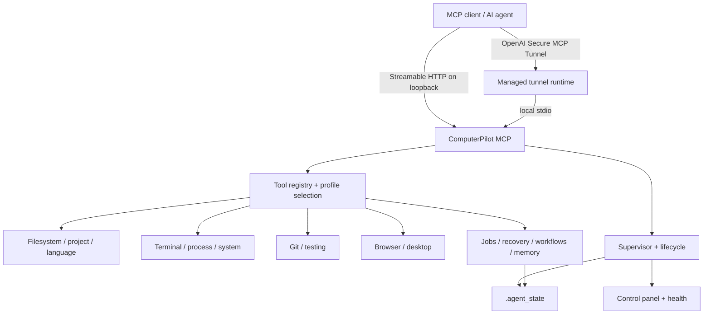

# Architecture

ComputerPilot MCP is a supervised local MCP runtime that combines typed developer/computer-use tools with durable jobs, explicit recovery, and platform capability detection.

## Runtime overview

## Tool registration

`core/registry.py` is the top-level MCP construction point.

It:

1. detects host capabilities;
2. resolves the requested tool profile;
3. removes unsupported domains;
4. registers typed domain tools;
5. adds domain discovery, recommendation, and health tools.

The public display title is **ComputerPilot MCP**. The protocol-level server identifier remains `ali_windows_agent_mcp` for compatibility with existing client/tunnel configuration.

## Platform capability model

The runtime does not pretend every host provides identical features.

Portable domains include the shared filesystem/project/Git/testing/jobs/recovery/workflow core. Platform adapters decide whether Windows-only capabilities such as native desktop input, UI Automation, `run_cmd`, services, and installed-software backends are registered.

Process ownership is intentionally implemented differently:

- Windows: Job Objects.
- Linux/macOS: dedicated sessions/process groups with bounded TERM/KILL escalation.

## Supervisor and lifecycle

The launchers start `scripts.bootstrap`, which validates the environment and then starts `scripts.supervisor`.

The supervisor owns runtime lifecycle concerns such as:

- start/restart/stop;
- health observation;
- bounded retry/backoff;
- mutation-aware drain before planned restarts;
- process cleanup;
- loopback control panel.

The runtime tracks lifecycle state so new mutations can be blocked while a controlled drain is in progress.

## Durable jobs

Long-running commands can be moved out of a single MCP request.

Durable jobs persist state in SQLite and capture output on disk. The subsystem supports:

- idempotency keys;
- queue vs execution timeout separation;
- bounded admission control;
- independent workers;
- cancellation;
- restart survival;
- monotonic status versions;
- version-aware waiting;
- incremental output cursors.

The persistent job store, not one in-memory runtime object, is the source of truth.

## Recovery model

External side effects are not assumed to be replay-safe.

Standalone mutations use the operation recovery journal. Durable workflows maintain operation checkpoints and reconciliation intent in the workflow store.

If a runtime disappears after a side effect may have occurred but before the final outcome is known, the operation can remain `uncertain`.

Resolution paths are:

1. inspect durable evidence;
2. reconcile against an allowlisted postcondition;
3. explicitly acknowledge an operator conclusion if evidence cannot decide.

The system deliberately does not blind-retry arbitrary ambiguous shell/process effects.

## Durable workflows

Workflows persist:

- exact execution definitions;
- aggregate and step state;
- operation checkpoints;
- optimistic versions;
- leases;
- events;
- cancellation;
- reconciliation evidence.

Built-in plans include `implement_and_verify`, `safe_git_commit`, and `prepare_release`.

Workflow persistence is separate from durable job process state. Jobs own process completion/output; workflows own orchestration and operation lifecycle.

## Filesystem editing

Mutation tools use scoped resource locks so unrelated files can remain concurrent.

Editing primitives include:

- atomic whole-file write;
- exact replacement;
- anchored replacement;
- AST-selected Python function/class body edits;
- transactional unified patches;
- validation-and-rollback refactors.

Hash/version preconditions are available on operations where stale external edits matter.

## Project and language intelligence

Python project analysis maintains bounded version-aware metadata rather than re-parsing every unchanged file for every query.

The LSP layer supports bounded one-shot intelligence and transactional workspace edits. It uses a discovered trusted `pyright-langserver --stdio` command and does not install or run arbitrary caller-provided language-server executables.

## Browser and desktop automation

Playwright browser sessions use isolated contexts. Compatible sessions can share browser processes, while session/pool budgets and idle eviction bound resource growth.

Windows can additionally expose:

- native desktop screenshots;
- mouse/keyboard input;
- semantic UI Automation.

These tools are capability-gated and are not registered on unsupported hosts.

## State ownership

Generated state is intentionally local and separated by responsibility.

| Store | Owns |
| --- | --- |
| job database + output | durable command lifecycle and stdout/stderr |
| workflow database | definitions, orchestration state, operations, leases, events |
| recovery journal | standalone mutation ambiguity/evidence |
| project memory | bounded advisory project facts |
| artifacts/backups/screenshots/search snapshots | bounded generated supporting data |
| tunnel runtime cache | verified external Secure Tunnel runtime |

Project memory is advisory data, not execution authority or a policy override.

## Control plane vs workload

Health/status paths are designed to remain lighter than the workloads they observe. Runtime resource budgets cover browser sessions, jobs, caches, artifacts, backups, audit files, and history retention.

See [Configuration](configuration.md) for the exposed budget controls.
