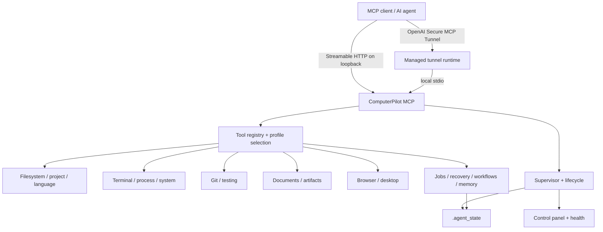

# Architecture

ComputerPilot MCP is a supervised local MCP runtime that combines typed developer/computer-use tools with durable jobs, explicit recovery, and platform capability detection.

## Runtime overview


```mermaid
flowchart TD
    C[MCP client / AI agent] -->|Streamable HTTP on loopback| M[ComputerPilot MCP]
    C -->|OpenAI Secure MCP Tunnel| T[Managed tunnel runtime]
    T -->|local stdio| M

    M --> R[Tool registry + profile selection]
    R --> FS[Filesystem / project / language]
    R --> EX[Terminal / process / system]
    R --> DEV[Git / testing]
    R --> DOC[Documents / artifacts]
    R --> AUTO[Browser / desktop]
    R --> DUR[Jobs / recovery / workflows / memory]

    M --> S[Supervisor + lifecycle]
    S --> P[Control panel + health]
    S --> ST[.agent_state]
    DUR --> ST
```

## Tool registration

`core/registry.py` is the top-level MCP construction point.

It:

1. detects host capabilities;
2. resolves the requested tool profile;
3. removes unsupported domains;
4. registers typed domain tools;
5. adds domain discovery, recommendation, and health tools.

The public display title is **ComputerPilot MCP**. The protocol-level server identifier remains `ali_windows_agent_mcp` for compatibility with existing client/tunnel configuration.

## Adaptive execution router

`core/tool_catalog.py` is the shared execution metadata source for discovery enrichment, route planning, and workflow route checks. The live MCP registry remains the authority for availability: a catalog entry never makes an unregistered tool selectable.

`core/execution_router.py` is a pure decision layer:

```text
structured execution intent
    -> registered candidate generation
    -> platform/capability filtering
    -> hard safety constraints
    -> deterministic-v1 ranking
    -> explainable route decision
```

The router does not launch applications, take screenshots, execute commands, mutate files, or perform external probes while choosing a route. Candidate availability comes only from the registered tool names supplied by the current MCP server and the supplied platform capability snapshot.

The initial policy ranks valid candidates lexicographically by stronger determinism, recoverability, lower side-effect risk, capability confidence, lower cost/latency tiers, and stable route/tool tie-breakers. Hard constraints run first and cannot be overridden by ranking. In particular, stale semantic references do not fall back to coordinates, destructive ambiguous semantic actions fail closed, raw desktop requires explicit permission and is forbidden for destructive fallback, and document fidelity constraints such as macro preservation eliminate routes that cannot prove them.

Public APIs are read-only `execution_candidates` and `execution_recommend`. v0.7 deliberately has no universal `execution_run` dispatcher. `visual.desktop` is reserved but unavailable until the visual-grounding phase.

## Platform capability model

The runtime does not pretend every host provides identical features.

Portable domains include the shared filesystem/project/Git/testing/documents/jobs/recovery/workflow core. Platform adapters decide whether Windows-only capabilities such as native desktop input, UI Automation, `run_cmd`, services, and installed-software backends are registered.

Process ownership is intentionally implemented differently:

- Windows: Job Objects.
- Linux/macOS: dedicated sessions/process groups with bounded TERM/KILL escalation.

## Supervisor and lifecycle

The launchers start `scripts.bootstrap`, which validates the environment and then starts `scripts.supervisor`.

The supervisor owns runtime lifecycle concerns such as:

- start/restart/stop;
- health observation;
- bounded retry/backoff;
- mutation-aware drain before planned restarts;
- process cleanup;
- loopback control panel.

The runtime tracks lifecycle state so new mutations can be blocked while a controlled drain is in progress.

### Observability and local operations console

The Supervisor also owns the loopback operations surface at `http://127.0.0.1:8766/`. The panel is local-only and reads bounded, redacted state rather than exposing arbitrary shell/process control.

Its data model is split so frequent refreshes stay lightweight while detailed views are fetched on demand:

- summary/build/Git identity and runtime health;
- resource budgets, storage consumers, performance timing, capabilities, and safe configuration;
- transport diagnosis/history plus confirmed poll-stall recovery state;
- Recent Jobs with bounded incremental/downloadable output and guarded cancellation;
- Recent Operations with searchable/filterable audit metadata and full-target inspection;
- workflow, recovery, execution-routing, tool-activity, process, Doctor, and diagnostics views.

Generation-scoped runtime-health and tool-activity snapshots let the Supervisor observe the live MCP process without constructing a second MCP server. Audit/transport records are metadata-only and are bounded by retention/rotation settings.

## Durable jobs

Long-running commands can be moved out of a single MCP request.

Durable jobs persist state in SQLite and capture output on disk. The subsystem supports:

- idempotency keys;
- queue vs execution timeout separation;
- bounded admission control;
- independent workers;
- cancellation;
- restart survival;
- monotonic status versions;
- version-aware waiting;
- incremental output cursors.

The persistent job store, not one in-memory runtime object, is the source of truth.

## Recovery model

External side effects are not assumed to be replay-safe.

Standalone mutations use the operation recovery journal. Durable workflows maintain operation checkpoints and reconciliation intent in the workflow store.

If a runtime disappears after a side effect may have occurred but before the final outcome is known, the operation can remain `uncertain`. Document publication checkpoints its validated final file hash before the atomic replacement, so that crash window retains a reconciler-compatible postcondition.

Resolution paths are:

1. inspect durable evidence;
2. reconcile against an allowlisted postcondition;
3. explicitly acknowledge an operator conclusion if evidence cannot decide.

The system deliberately does not blind-retry arbitrary ambiguous shell/process effects.

## Durable workflows

Workflows persist:

- exact execution definitions;
- aggregate and step state;
- operation checkpoints;
- optimistic versions;
- leases;
- events;
- cancellation;
- reconciliation evidence;
- optional structured execution intent;
- selected execution route and router policy version;
- compact route decision metadata and bounded fallback history.

For routed steps, the route decision is persisted before the operation enters the side-effect path and must match the fixed allowlisted workflow action route. A safe retry may record a capability-driven route change before a new side effect, but an uncertain operation is never rerouted or replayed until reconciliation conclusively resolves the existing effect.

Built-in plans include `implement_and_verify`, `safe_git_commit`, and `prepare_release`.

Workflow persistence is separate from durable job process state. Jobs own process completion/output; workflows own orchestration and operation lifecycle.

## Filesystem editing

Mutation tools use scoped resource locks so unrelated files can remain concurrent.

Editing primitives include:

- atomic whole-file write;
- exact replacement;
- anchored replacement;
- AST-selected Python function/class body edits;
- transactional unified patches;
- validation-and-rollback refactors.

Hash/version preconditions are available on operations where stale external edits matter.

## Native document adapters

The `documents` domain uses file-format libraries directly instead of automating desktop applications.

- Excel supports `.xlsx` and `.xlsm`, bounded workbook/range/search/formula/table reads, and guarded value/formula/sheet/table mutations.
- DOCX supports metadata/structure inspection, bounded paragraph/table reads and search, plus conservative paragraph/text/table-cell mutations.
- PDF supports metadata/page inspection, bounded text extraction, and deterministic creation from plain text or a limited Markdown subset.

Binary document mutations share a publication primitive: per-target in-process and inter-process locking, optional source SHA-256 preconditions, same-directory staging, format-specific validation, recoverable backups, an fsynced recovery postcondition checkpoint before publication, atomic replacement, and final hash/size verification. The result includes an artifact descriptor with path, SHA-256, byte size, and media type.

OOXML readers validate archive structure and bounded expansion before library parsing. Excel macro mutation is accepted only when the VBA project survives staged serialization byte-for-byte. DOCX intentionally refuses ambiguous formatting transformations and macro-enabled `.docm`; PDF creation does not claim arbitrary editing of existing PDFs.

## Project and language intelligence

Python project analysis maintains bounded version-aware metadata rather than re-parsing every unchanged file for every query.

The LSP layer supports bounded one-shot intelligence and transactional workspace edits. It uses a discovered trusted `pyright-langserver --stdio` command and does not install or run arbitrary caller-provided language-server executables.

## Browser and desktop automation

Playwright browser sessions use isolated contexts. Compatible sessions can share browser processes, while session/pool budgets and idle eviction bound resource growth.

Windows can additionally expose:

- native desktop screenshots;
- mouse/keyboard input;
- semantic UI Automation.

These tools are capability-gated and are not registered on unsupported hosts.

## State ownership

Generated state is intentionally local and separated by responsibility.

| Store | Owns |
| --- | --- |
| job database + output | durable command lifecycle and stdout/stderr |
| workflow database | definitions, orchestration state, operations, leases, events |
| recovery journal | standalone mutation ambiguity/evidence |
| project memory | bounded advisory project facts |
| artifacts/backups/screenshots/search snapshots | bounded generated supporting data |
| document lock directory | hashed cross-process coordination tokens for document mutation targets |
| tunnel runtime cache | verified external Secure Tunnel runtime |

Project memory is advisory data, not execution authority or a policy override.

## Control plane vs workload

Health/status paths are designed to remain lighter than the workloads they observe. Runtime resource budgets cover browser sessions, jobs, caches, artifacts, backups, audit files, and history retention.

See [Configuration](configuration.md) for the exposed budget controls.
